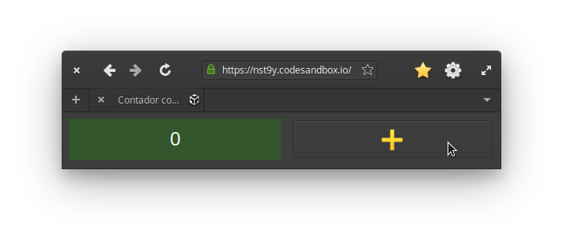

#+PROPERTY: header-args:js  :exports code
#+EXPORT_FILE_NAME: ../latex/capitulos/cases

# header-args is needed to use src_js{} for inline source code

* Dimensões de avaliação
  @@latex:\todo{Trecho vindo da introdução no corte de outubro de 2026, ainda por integrar a esta seção.}@@
  A avaliação usa as [[glspl:dc]], que [[textcite:blackwell2003][p. 106]] chamam de ferramentas
  de discussão, para quem projeta ou avalia artefatos de informação, e não
  de método analítico.

  [[textcite:blackwell2019][p. 58 e 60]] registram, na psicologia da
  programação, o pedido por ensaios controlados randomizados no estudo do
  projeto de linguagens e o ceticismo sobre apoiar nesse empirismo um
  processo de projeto complexo.
  Para eles, a parte cognitiva das [[glspl:dc]] importa bem menos que a teoria de
  projeto implícita nelas.

  As outras duas, /expressividade/ e /operações mentais difíceis/, vêm do grupo
  que [[textcite:kiss2014][p. 15]] deixou de fora e que, a seu ver, teria
  sido útil se as linguagens e os /toolkits/ comparados fossem muito mais
  diferentes.
  Na comparação principal, [[textcite:kiss2014][p. 11-12]] escolheu o
  ScalaFX porque este envolve o próprio JavaFX e porque o Scala é
  sintaticamente próximo do Java.
  Aqui, cada tecnologia traz as próprias abstrações, e as três notações
  diferem na forma de escrever a coordenação.
  E, ao avaliar bibliotecas reativas, ele próprio descreve o esforço
  mental de cada uma sem uma dimensão para isso
  [[cite:kiss2014][p. 87 e 97]].

  As duas tratam da leitura do código.
  A expressividade é a facilidade de reconhecer o propósito de cada
  trecho, e as operações mentais difíceis obrigam quem lê a contar nos
  dedos ou anotar à parte para acompanhar o que acontece cite:green1996d.
  Ao avaliar se quem lê entende uma especificação,
  [[textcite:britton2001][p. 267]] também as incluíram entre as dimensões
  especialmente úteis.
  Na comparação de textcite:mernik2009 entre o [[gls:xaml]] e o C# Forms, as duas
  estiveram entre as dimensões que mais pesaram na compreensão dos
  programas.

  As outras três do grupo ficam de fora.
  O compromisso prematuro nasce da ordem em que o ambiente obriga a
  construir o programa, e o código pronto não guarda essa ordem
  cite:green1996d.
  A consistência mede o quanto quem aprende consegue adivinhar da notação,
  e só se avalia por introspecção cite:green1996d.
  Já a notação secundária (comentários, indentação e nomes) é própria de
  quem escreve cite:green1996d.
  Aqui, ela é padronizada entre as tecnologias, e por isso não distingue
  uma notação da outra.
  As dimensões utilizadas neste trabalho são baseadas nas [[glspl:dc]] de
  textcite:green1989. Assim usamos critérios estabelecidos, o que facilita a
  comparação de nossos resultados com trabalhos baseados nas [[glspl:dc]]. O /framework/
  completo possui 14 dimensões, mas os autores recomendam usar um subconjunto
  apropriado para o artefato em mãos.

  # Traduzidas diretamente de KISS 2014
  - Nível de abstração :: /Disponibilidade e tipos de mecanismos de abstração/

       O sistema fornece alguma forma de definir novos termos com a notação pra
       que eles possam ser extendidos afim de descrever ideias claramente? Os
       detalhes podem ser encapsulados? O sistema insiste em definir novos
       termos? Qual o número de novos conceitos de alto nível devem ser
       aprendidos pra se fazer uso do sistema? Eles são fáceis de aprender e
       usar?

       Cada novo conceito é um empecilho pra aprendizagem e aceitação, mas
    também pode tornar um código complexo mais compreensível. Por exemplo, o
    React emprega o /fluxo de dados de mão única/ --- do inglês /one-way data
    flow/ ou /one-way binding/ --- em sua arquitetura. É necessário aprender
    conceitos novos para usar os componentes do React de forma adequada. Não
    compensa para aplicações pequenas, mas para aplicações complexas pode tornar
    o código mais compreensível e passível de manutenção porque os detalhes
    podem ser encapsulados em novos termos: os componentes.
    # maintainable: passível de manutenção, sustentável

    Outro exemplo é a função:

    #+begin_export latex
    \begin{citacao}
      A function has a name and, optionally, parameters as well as a body that
      returns a value following certain computational steps. A client can simply
      refer to a function by its name without knowing its implementation details.
      Accordingly, a function abstracts the computational process involved in the
      computation of a value. The learning barrier to the principle of a function is
      not great but it can still make a lot of code much more understandable 3 by
      hiding unimportant details.
      \cite[p.~13]{kiss2014}
    \end{citacao}
    #+end_export

  - Proximidade de descrição :: \todo{Traduzido de “Closeness of mapping”, poderia ser “Proximidade de mapeamento”} /Semelhança entre representação e o domínio/

       O quão relacionado é a notação com o resultado que ela descreve, ou
       melhor, o domínio do problema? Que partes parecem ser uma forma
       particularmente estranha de descrever algo?

       #+begin_export latex
       \begin{citacao}
         Um exemplo é a definição de layout de uma interface gráfica. Linguagens que
         não fornecem uma forma de descrever o layout de modo aninhado, ou seja,
         hierárquico, e como tal força o programador a “linearizar” o código com o uso
         desnecessário de variáveis intermediárias, dificultando enchergar como a
         estrutura de definição do layout corresponde com o layout final da aplicação.
         Não é atoa que especificações baseadas no XML são amplamente usadas na
         construção de interfaces gráficas em linguagens sem suporte nativo para
         representação hierárquica de layout.
         \cite[p.~13; tradução nossa]{kiss2014}
       \end{citacao}
       #+end_export

  - Dependências ocultas :: /Vínculos importantes implícitos entre entidades/

       As dependências entre as entidades da notação são visíveis ou ocultas?
       Todas as dependências são especificadas em ambas as direções? Alterações
       locais podem ter efeitos globais confusos?

       Se uma entidade cita outra, que por sua vez cita uma terceira, a
       alteração do valor da terceira entidade pode desencadear efeitos
       inesperados. O principal problema não é o fato de A depender de B, mas sim
       que a dependência não é explicitamente visível. Um caso bem conhecido de dependência
       oculta é o “problema da classe base frágil”[fn:fragile_base_class].

       # https://medium.com/ui-lab-school/guia-para-dimensoes-cognitivas-no-design-72d898a62bc7

       #+begin_export latex
       \begin{citacao}
         In (complex) class hierarchies a seemingly safe modification to a base class
         may cause derived classes to malfunction. The IDE in general cannot help
         discovering such problems and only certain programming language features can
         help preventing them. Another example are non-local side-effects in
         procedures, i.e. the dependencies of a procedure with non-local side-effects
         are not visible in its signature.
         \cite[pg.~14]{kiss2014}
       \end{citacao}
       #+end_export

  - Propensão a erros :: /Notação incita erros/

       Até que ponto a notação influência o programador a cometer um erro? Fazer
       algumas coisas parece ser particularmente complexo ou difícil, p. ex.,
       juntar várias coisas?
       # TODO: Melhorar, pois Berndt perguntou “o que são essas coisas?”

       Em muitas linguagens dinâmicas com definições implícitas de
       variáveis[fn:var_implicit_def], um erro de tipagem em uma variável pode
       de repente causar erros difíceis de encontrar já que o [[gls:ide]] nem sempre
       pode apontar tal erro devido a dinamicidade na linguagem. A inicialização
       implícita de variáveis com valor =null= pode levar a uma exceção de
       ponteiro nulo se o programador esquecer de inicializar as variáveis
       corretamente antes de usá-las.

  - Concisão         :: /Verbosidade da linguagem/
       # Diffuseness/terseness: difusão/concisão, ou dispersão
       Quantos símbolos ou quanto espaço a notação requer pra produzir um certo
       resultado ou expressar uma ideia. Que tipos de coisas ocupam mais espaço
       para se descrever?

       #+begin_export latex
       \begin{citacao}
         Some notations can be annoyingly long-winded, or occupy too much valuable
         “real-estate” within a display area. In Java before version 8 in order to
         express what are lambdas today anonymous classes were employed. Compared to
         Java 8’s lambdas these anonymous classes used to be a very verbose way of
         encoding anonymous functions especially when used in a callback-heavy setting
         like traditional GUI programming~\cite[p.~14]{kiss2014}.
         \todo[inline]{Pensar num exemplo mais próximo da Web e substituir citação direta.}
       \end{citacao}
       #+end_export

       # TODO: Comentar que concisão a custo de intenção explícita prejudica
       # legibilidade.

  - Viscosidade     :: /Resistência a mudanças/

       Existe alguma barreira contra mudança na notação? Quanto esforço é
       necessário pra fazer uma alteração num programa expresso na notação?

       Num sistema viscoso o usuário precisa realizar várias passos para
       concluir uma tarefa. Alterar o tipo de retorno de uma função pode causar
       erros em várias partes do código onde a função é chamada. Nesses casos um
       [[gls:ide]] pode ajudar muito.

  Outras dimensões que ficaram de fora são:

  - Comprometimento prematuro: /limitações na ordem de fazer as coisas/
  - Expressividade: /o propósito de uma entidade pode ser rapidamente determinado/
  - Consistência: /semânticas parecidas são apresentadas em estilo sintático
    parecido/
  - Operações mentais difíceis: /alto esforço cognitivo pra realizar tarefas/
  - Notação secundária: /informações extras por meio de notações além das
    formais/
  \todo[inline]{Berndt sugeriu considerar “Expressividade” e “Operações mentais difíceis”.}
  # Uma operação mental difícil é a leitura de um laço “for”. O usuário precisa
  # manter na memória os valores de todas as variáveis intermediárias envolvidas
  # na iteração. É um mal sinal se o usuário precisa fazer um teste de mesa para
  # entender a lógica.

  # “Uma notação pode tornar as coisas desnecessariamente complexas para o
  # usuário se ele faz exigências excessivas na sua memória de curta duração.”

  # “É um mau sinal se o usuário precisa usar um bloco de notas para fazer
  # anotações ao invés de continuar usando o sistema.”

  # https://medium.com/ui-lab-school/guia-para-dimensoes-cognitivas-no-design-72d898a62bc7

  Em outras situações, e dependendo dos artefatos de informação, essas dimensões
  poderiam ser úteis. Se tivéssemos focado mais nas ferramentas e no processo de
  construção dos estudos de caso então as seguintes dimensões poderiam ser usadas:

  # progressive evaluation: análise/verificação
  # provisionality: momentaneidade, transitoriedade, provisoriedade
  - Visibilidade: /habilidade de ver os componentes claramente/
  - Análise progressiva: /trabalho realizado pode ser verificado em qualquer
    momento/
  - Provisoriedade\todo{'momentaneidade' ou 'transitoriedade'}: /grau
    de comprometimento com uma ação ou marco/

* *Revisão do JavaScript
  # TODO: Berndt disse p/ colocar como apêndice

  Talvez devêssemos colocar uma seção de revisão das ferramentas utilizadas na
  implementação dos estudos de caso? Poderíamos descrever os recursos relevantes
  para nossa análise.
  \todo[noline]{Berndt disse p/ colocar como apêndice}

* Processamento de listas

  Uma coleção é um agrupamento com uma quantidade variável de itens, que (1)
  compartilham algum significado ao problema a se resolver e (2) precisam ser
  manipulados juntos de forma controlada.

  O único tipo de coleção no JavaScript é o arranjo, ou /array/, que pode ser
  construído através do objeto[fn:prototypes] global src_js{Array}, ou da
  notação de arranjos literais com colchetes:

  # TODO: find a way to insert a '\legend{}' before '\end{listing}' for the
  # reference. Take a look at function org-latex-src-block in ox-latex.
  #+caption: Criando coleções
  #+begin_src js
  var collection1 = new Array();
  var collection2 = [];
  #+end_src

  Uma tarefa muito comum na programação é a iteração[fn:iteration] de coleções.
  Um mecanismo muito utilizado para tal é o comando src_js{for}. Em
  \ref{code:forLoopTraverse} é demonstrado o uso do comando src_js{for} para
  percorrer os itens da coleção src_js{people} e mostrar cada um no console de
  depuração.

  #+caption: Percorrendo uma coleção com o laço src_js{for}
  #+name: code:forLoopTraverse
  #+BEGIN_SRC js
  var people = ["Alan Turing", "Alonzo Church", "Kurt Gödel"];
  var count  = 0;

  for (count = 0; count < people.length; count++) {
    console.log(people[count]);
  }
  #+END_SRC

** Formatação de preços

   Nesta seção veremos como formatar uma lista preços para serem mostrados na
   tela, p. ex., transformando um valor numérico src_js{50.45} em uma /string/
   src_js{"R$ 50.45"}. Para isso usamos uma função de formatação que é aplicada
   a cada valor da lista. A função de formatação pode ser observada em
   ref:code:formatPriceFunction.
   # Esse processo de transformação é chamado de projeção

   #+caption: Função pra formatar um preço
   #+name: code:formatPriceFunction
   #+BEGIN_SRC js
   function formatPrice(price) {
     return 'R$' + price.toFixed(2);
   }
   #+END_SRC

   Em ref:code:formatPricesFor pode-se ver a solução implementada com o laço
   src_js{for}.

   #+caption: Formatação de preços com laço src_js{for}
   #+name: code:formatPricesFor
   #+BEGIN_SRC js
   const prices = [50.45, 47, 20.99, 3.44, 1];
   let formatedPrices = [];

   for (let i = 0; i < prices.length; i++) {
     formatedPrices.push(formatPrice(prices[i]));
   }
   #+END_SRC

   Em ref:code:formatPricesMap pode-se ver a solução implementada com a função
   src_js{map}.

   #+caption: Formatação de preços com laço src_js{for}
   #+name: code:formatPricesMap
   #+BEGIN_SRC js
   const prices = [50.45, 47, 20.99, 3.44, 1];

   const formatedPrices = prices.map(formatPrice);
   #+END_SRC

   Outras ideias:

   - Adicionar $1$ a cada número de uma lista
   - Multiplicar os números de uma lista
   - Transformar palavras com letras minúsculas de uma lista em palavras com
     letras maiúsculas

** Seleção de valores com =filter()=
   Remover nomes que não começam com ‘S’

** Nivelamento de valores com =concatAll()=
** Redução de valores com ~reduce()~

   O método src_js{reduce()} executa uma função *reducer* para cada item da
   lista, resultando num único valor. Em ref:code:somaDePreçosComReduce é
   demostrado a soma dos preços de uma lista usando o método src_js{reduce()}.
   Nesta demonstração a função src_js{somar()} é o *reducer*.
   # https://developer.mozilla.org/pt-BR/docs/Web/JavaScript/Reference/Global_Objects/Array/Reduce

   #+caption: Soma dos preços de uma lista com o método src_js{reduce()}.
   #+name: code:somaDePreçosComReduce
   #+begin_src js
   const preços = [50.45, 47, 20.99, 3.44, 1];

   const somar = (a, b) => a + b;
   const total = preços.reduce(somar);
   #+end_src

** Agrupamento de valores com ~zip()~

* Coordenação de eventos
  @@latex:\todo{Trecho vindo da introdução no corte de outubro de 2026, ainda por integrar a esta seção.}@@
  A triagem em geral se apoia no que se escreveu sobre as alternativas, e não
  no uso delas [[cite:kitchenham1996][p. 15]].
  Aqui, ela se apoia também no uso de duas das notações, porque o autor
  escreveu implementações de referência em React e em JavaScript com
  /callbacks/.

  Na Pesquisa Código Fonte TV 2026, a única sobre o Brasil, React, Angular e
  jQuery são a ferramenta mais usada no dia a dia por 7,6%, 3,3% e 0,3% dos
  participantes cite:codigofonte2026.
  No W3Techs, o React está em 6,0% dos /sites/ e o Angular em 0,2%
  cite:w3techs2026,w3techs2026a.
  Só o State of JS dá número ao Solid, que tem uma resposta na Pesquisa
  Código Fonte TV.
  Na escrita das implementações, a familiaridade desigual do autor pesa
  menos, porque elas seguem a mesma especificação e são padronizadas entre
  as tecnologias.

  [[textcite:kiss2014][p. 11]] também compara as implementações pela
  usabilidade do código, e não por tempo de execução e memória, como num
  /benchmark/ tradicional.

  Cada pesquisa de uso tem um limite de amostra.
  Os respondentes do Stack Overflow Developer Survey 2025 são recrutados
  sobretudo pelos próprios canais do site, o que favorece os usuários mais
  ativos cite:stackoverflow2025.
  No W3Techs, basta achar a biblioteca em qualquer página para o /site/
  contar, o que favorece o jQuery e nada diz das aplicações novas
  cite:w3techs2026,w3techs2026a.
  O State of JS 2025 é um levantamento aberto a quem quiser responder, que se
  declara o retrato de um subconjunto de desenvolvedores cite:devographics2026.
  Na Pesquisa Código Fonte TV 2026, cada participante escolhe uma só
  ferramenta, entre 130 de todas as áreas, o que encolhe as fatias, e a
  audiência do canal que a divulga tende a estar super-representada
  cite:codigofonte2026.
  O W3Techs nem separa o Angular do AngularJS, antecessor dele e sem
  suporte desde 2022 cite:thompson2022; a Pesquisa Código Fonte TV os
  separa e dá 571 participantes ao Angular e 78 ao AngularJS
  cite:codigofonte2026.

  O jQuery e o Web Component derivam a Lista filtrável com =filter=, =sort= e
  =map=, funções de [[gls:pf]].
  E o React e o Solid recorrem a efeitos para sincronizar o componente com
  sistemas externos, como o armazenamento do navegador no Carrinho.
  A documentação do React chama os efeitos de “uma saída de emergência do
  paradigma do React” [[cite:meta2026b][tradução nossa]].

  Três das cinco tarefas partem do 7GUIs [[cite:kiss2014][p. 17, 25 e 34]]:

  - Contador :: a tarefa /Counter/;
  - Formulário com validação :: a /Flight Booker/, ampliada com os campos de
    um formulário real;
  - Lista filtrável :: o filtro por prefixo da tarefa /Crud/.

  O /Timer/ trata da concorrência entre um relógio e o usuário, mas nenhuma
  das sete tarefas faz uma requisição cujas respostas chegam fora de ordem ou
  são canceladas [[cite:kiss2014][p. 30]].
  E nenhuma põe três componentes independentes para ler e alterar o mesmo
  estado, como os do Carrinho.

  No React, um valor derivado é uma expressão comum, recalculada a cada
  execução do componente cite:meta2026b.
  No Solid, é uma função que lê o /signal/ cite:solidjs2026a.

  No Android, as duas variantes são escritas em Kotlin, a linguagem que o
  Android recomenda e a única em que o Compose se escreve cite:android2026a.
  O porte do domínio para Kotlin responde diferente em entradas-limite, como
  anos de 0 a 99, e cada diferença conhecida fica registrada num teste.
  Entre Views e Compose, a única diferença admitida nas capturas é a de
  poucos pixels na renderização do texto.

** Contador

   # estrutura mínima
   - Problema :: entender os conceitos essenciais da linguagem e a estrutura
     básica necessária

   #+CAPTION: Interface gráfica do Contador.
   #+NAME: img:contador
   #+ATTR_LATEX: :width 12cm :center t
   
   # https://stackoverflow.com/a/42170221/1787829
   # Ctrl-c Ctrl-l (org-insert-link) -> “file:”
   # Dá pra configurar o :width globalmente

   A implementação do contador usando classes poder ser observado em
   ref:code:contadorComPOO.

   #+caption: Contador com POO.
   #+name: code:contadorComPOO
   #+BEGIN_SRC js
   // No Java isto extenderia alguma classe padrão do toolkit,
   // como `Application`
   class Contador {
     constructor(props) {
       // Em Java estas propriedades precisam ser definidas antes
       this.contador = props.valorInicial;
       this.caixaDoValor = document.getElementById("valor");
       this.botãoDeIncrementar = document.getElementById("botãoDeIncrementar");
       this.botãoDeIncrementar.addEventListener(
         "click",
         // Isto requer uma explicação um tanto extensa
         this.tratarClique.bind(this)
       );
     }

     tratarClique(_evento) {
       this.contador = this.contador + 1;
       this.renderizar();
     }

     // Equivalente ao `public static void main()` do Java
     renderizar() {
       this.caixaDoValor.innerText = this.contador;
     }
   }

   const contador = new Contador({ valorInicial: 0 });
   // Como no Java o `main()` é padronizado, sua execução seria
   // feita automaticamente pelo ambiente de execução.
   contador.renderizar();
   #+END_SRC
   # https://codesandbox.io/s/contador-com-oop-callbacks-nst9y

   # Como fazer o ref se vincular com a linha no código? No LaTeX não está
   # funcionando: https://orgmode.org/manual/Literal-Examples.html
   O src_js{tratarClique.bind(this)} na linha 12 requer uma explicação um tanto
   extensa.

   O contador usando função e operadores do xstream pode ser observado em
   ref:code:contadorComPR.

   #+caption: Contador com PR.
   #+name: code:contadorComPR
   #+BEGIN_SRC js
   import fromEvent from "xstream/extra/fromEvent";

   const Contador = props => {
     const caixaDoValor = document.getElementById("valor");
     const botãoDeIncrementar = document.getElementById("botãoDeIncrementar");

     // Fluxo que emite um evento toda vez que o botão for clicado
     const cliqueStream = fromEvent(botãoDeIncrementar, "click");

     // Fluxo que emite "valor + 1" (acumulado) toda vez que
     // cliqueS emite um evento
     const contadorStream = cliqueStream.fold(
       (valor, _evento) => valor + 1,
       props.valorInicial
     );

     const observador = {
       next: valor => {
         caixaDoValor.innerText = valor;
       }
     };

     contadorStream.addListener(observador);
   };

   Contador({ valorInicial: 0 });
   #+END_SRC

   # O “$” quebra o LaTeX quando usado no comentário do código. A solução talvez
   # seja usar anotações/annotations: https://tex.stackexchange.com/a/86457/103967

*** Análise

    Essa primeira análise é focada no básico.

**** Nível de abstração
     Na solução com [[gls:poo]] os conceitos da linguagem que deve-se entender são:
     classes, construtor, objetos, propriedades, métodos, /callbacks/ na forma
     de método, e conhecimento da [[gls:api]] do objeto do documento do [[gls:html]] ---
     [[gls:dom]].
     Além do caso do src_js{this} específico do JavaScript:
     src_js{this.tratarClique.bind(this)}.
     Embora sejam conceitos básicos para um programador experiente em JavaScript
     e [[gls:poo]], o número é grande.
     Abstrações mais sofisticadas não são necessários pelo Contador e o sistema
     não insiste em abstrações especiais.
     Apesar da solução usar uma quantidade considerável de conceitos, eles são
     básicos, então observamos que o Nível de Abstração é baixo, ou seja, bom.

     Em contrapartida, na solução com [[gls:pr]] os conceitos usados são: funções,
     variáveis, fluxos e eventos, callbacks, e a [[gls:api]] do [[gls:dom]].
     A abstração mais sofisticada é o método src_js{fold()} do fluxo de evento,
     que nada mais é que uma versão assíncrona do src_js{Array.reduce()}
     nativo --- veja a soma de preços em ref:code:somaDePreçosComReduce.
     Ambos produzem um resultado para cada elemento da lista.
     A diferença é que no primeiro a lista é de eventos assíncronos, e infinita.
     No segundo a lista é síncrona, com valores escales (números, /strings/,
     objetos, etc.).
     \todo{Paralelo entre métodos assíncronos e síncronos em outra seção?}
     Níveis mais altos de abstração não são necessários, então a solução com [[gls:pr]]
     é igualmente boa ou um pouco melhor que a solução com [[gls:poo]] quanto ao Nível
     de Abstração.

**** Proximidade de descrição
     Essa dimensão/critério faz mais sentido para análise de apresentação do que
     comportamento (coordenação de eventos).

**** Dependências ocultas
     \todo[noline]{Acredito que o HTML só não está situado no mesmo local que o código JavaScript, que é diferente de “oculto”.}
     As únicas dependências que podem ser consideradas ocultas são os elementos
     [[gls:html]] buscados pelo identificador com =document.getElementById("id")=.

**** Propensão a erros
     Na solução com [[gls:poo]], esquecer de vincular a instância do contador à função
     =tratarClique()= resultará no erro “TypeError: this.renderizar is not a
     function”.
     Pois o valor do =this= estará vinculado ao objeto que chamou
     =tratarClique()=, ou seja, o =this.botãoDeIncrementar=.
     \todo{Talvez isso seja uma dependência oculta?}
     Isso se deve ao fato de a palavra chave =this= se comportar de forma
     diferente no JavaScript quando comparado com outras linguagens.

     # https://developer.mozilla.org/pt-BR/docs/Web/JavaScript/Reference/Operators/this
     #+begin_quote
     In most cases, the value of this is determined by how a function is called
     (runtime binding). It can't be set by assignment during execution, and it
     may be different each time the function is called. ES5 introduced the
     bind() method to set the value of a function's this regardless of how it's
     called, and ES2015 introduced arrow functions which don't provide their own
     this binding (it retains the this value of the enclosing lexical context).
     cite:This2020.
     #+end_quote

     #+begin_export latex
     \todo[inline]{Nos próximos exemplos acredito que podemos usar as funções de seta
       como callback no lugar dos métodos, pois possuem o valor do this vinculado
       lexicalmente. O Java possui lambdas desde a versão 8, o que despensa o uso de
       métodos para casos como esse. Ou já removemos desse primeiro? Pra evitar ter
       que explicar o \texttt{.bind(this)} que é um problema específico do
       JavaScript}.
     #+end_export

     Na solução com [[gls:pr]], esquecer de definir o observador fará com que a
     =caixaDoValor= não seja atualizada.
     Pois ela não será renderizada, apesar de toda a lógica do contador
     funcionar.
     Apesar de tudo, essas possibilidades de erros não são críticas.

**** Concisão
     Na solução com [[gls:poo]] o método src_js{tratarClique()}, usado como /callback/,
     poderia ser substituído por uma função de seta.
     Além de poupar algumas linhas o uso do src_js{.bind(this)} se torna
     desnecessário.
     Veja o código do Contador com [[gls:poo]] e função de seta em
     ref:code:contadorComPOOeFuncDeSeta no apêndice.
     Na solução com [[gls:pr]] a variável intermediária src_js{contadorStream} poderia ser
     removida, encadeando a chamada do src_js{fromEvent} com o src_js{fold()}:
     src_js{const cliqueStream = fromEvent().fold()}.
     No entanto essa manobra diminuiria a legibilidade do
     código[fn:encadeamento].
     De qualquer forma, a [[gls:pr]] evita a verbosidade da declaração da classe e dos
     métodos, além da repetição do src_js{this}.
     Então em termos de Concisão a [[gls:pr]] está à frente da [[gls:poo]].

**** Viscosidade
     Num caso tão simples como o do Contador a única resistência a alteração
     está em renomear atributos no caso da [[gls:poo]], e variáveis na [[gls:pr]].
     No entanto isso é inevitável ao renomear termos.
     Além disso o [[gls:ide]] pode ajudar através de uma funcionalidade de refatoração.
     \todo{Talves seja interessante analisar a viscosidade da alteração pra colocar um botão de decremento (-1) do Contador.}

** Reserva de voo

* Footnotes

[fn:encadeamento] Note que o nome da variável src_js{cliqueStream} já nem faz mais
sentido, pois o resultado da expressão não inclui apenas os eventos de clique.

[fn:prototypes] Diferente da maioria das linguagens, em que objetos são
instâncias de classes, no JavaScript os objetos são extensões de /protótipos/.

[fn:iteration] O processo de percorrer, um por um, os itens de uma coleção.

[fn:var_implicit_def] Isto é, quando não se precede uma definição de variável
com =var= ou =let= por exemplo.

[fn:fragile_base_class] Veja: https://en.wikipedia.org/wiki/Fragile_base_class.
